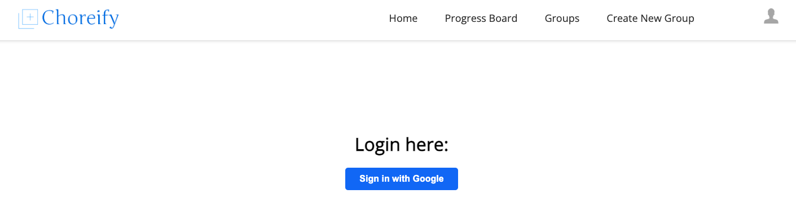
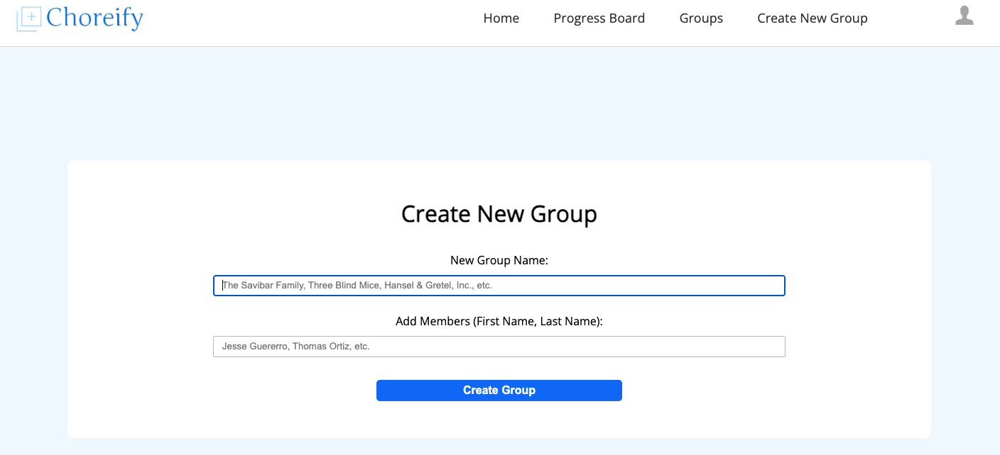
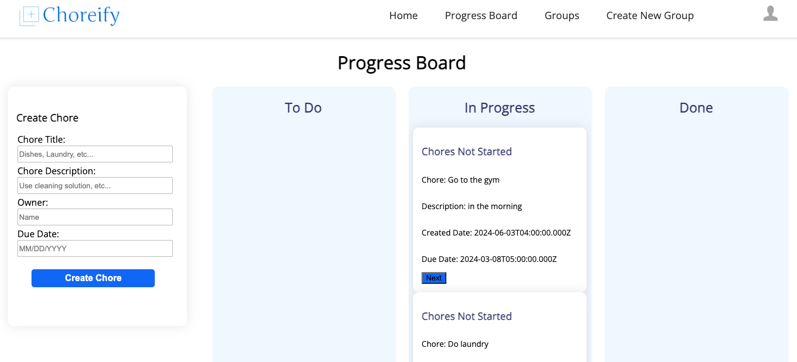

# Choreify

Choreify is a a task management application that brings a unique approach to household chores, emphasizing accountability, and breaking down larger tasks into manageable components.

### Features

Create an account with Google.

Create a group for your household, and add members to it.

Create tasks, and manage them on the progress board.

### Getting Started

- Ensure you have a Firebase API key and ElephantSQL URI available
- Install npm
- Run 'npm install' to install dependencies

Then
- Run 'npm run dev' to run the appliation in development on localhost 8080

    or
- Run 'nmp run build' to build the production bundle
- Run 'npm start' to run the application on localhost 3000
- Host it through your preferred service, and make it your own!

### Contributing

Contributions are welcome - simply fork this repository, make a pull request, and reach out to someone on the team!
